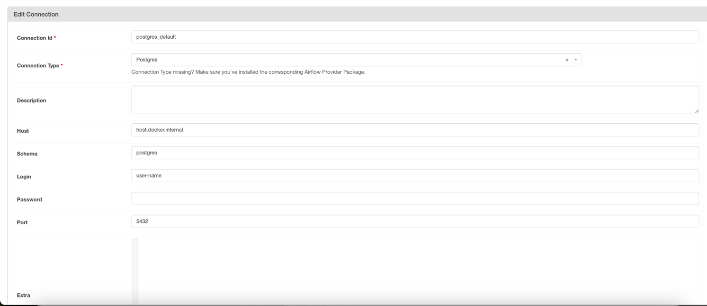

## Project: Data Engineering Challenge

This project demonstrates a complete data engineering pipeline using Airflow, MongoDB, PostgreSQL, and Python. It processes power production data from distributed energy assets and supports multiple components like imbalance calculation, invoicing, and exchange integration.


###  Environment Setup - Create a Virtual Environment

```
python -m venv flex
source flex/bin/activate

```


### Start the Services

1. Contains Postgres -> used as a DWH which contains two schemas landing and data-products
2. Metabase as a BI tool
3. Airflow as a orecentrator tool

Access Airflow at: http://localhost:8080


### Prerequisite

Make sure you have following databases in postgres;
1. metabase_db
2. DWH


Add Postgres connection in airflow , image is attached




```bash
docker-compose up --build -d
```


## Directory Structure

```angular2html

├── airflow-data/
│   └── app/
├── app/
├── common/
│   ├── __init__.py
│   ├── mongo_db_connector.py
│   └── postgress_connection.py
├── dags/
│   └── app/
│       ├── asset_portfolio_kpis.py
│       ├── data_acquisition_landing.py
│       ├── invoicing_kpis.py
│       └── README.md
├── data/
├── flex/
├── src/
│   ├── distribution_system_operator/
│   │   ├── data_products/
│   │   ├── domain_description/
│   │   ├── __init__.py
│   │   ├── ingest_dso_asset_production_data.py
│   │   ├── redispatch_landing.py
│   │   └── README.md
│   ├── exchange/
│   │   ├── data_products/
│   │   ├── domain_description/
│   │   ├── ingest_exchange_trade_data.py
│   │   └── README.md
│   ├── imbalance/
│   │   ├── data_products/
│   │   ├── domain_description/
│   │   ├── ingest_imbalance_price.py
│   │   └── README.md
│   ├── invoicing/
│   │   ├── data_products/
│   │   ├── domain_description/
│   │   ├── __init__.py
│   │   ├── assets_contract.py
│   │   └── README.md
│   └── vpp/
│       ├── data_products/
│       ├── domain_description/
│       ├── live_measured_infeed/
│       ├── technical_data/
│       ├── __init__.py
│       ├── client.py
│       ├── vpp_asset_portfolio_forecasts.py
│       └── README.md
├── task-6-reporting-and-dashboard/
├── Task-7-Data-Permissions-Framework.md
├── .env
├── .gitignore
├── .pre-commit-config.yaml
├── config.py
├── docker-compose.yaml
├── Dockerfile
├── img.png
├── requirements.txt
└── README.md


```


---

### Module-Level Documentation 

Module level documentation is present in each module under src.

1. Distribution_system_operator
2. Exchange
3. Imbalance
4. Invoicing
5. Vpp


* ### Data Permissions Framework
* 
* A detailed data perimision and governancne framework is also present in src module
* 
* 