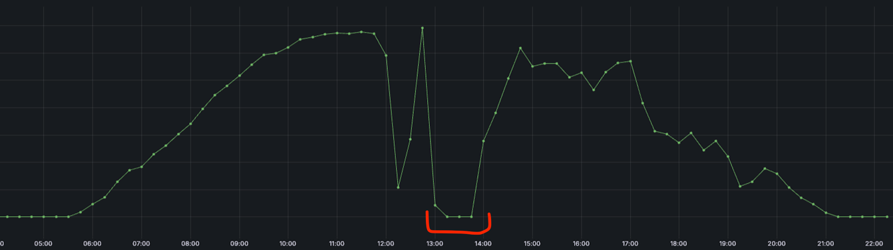

# Distribution System Operator (DSO)
A Distribution System Operator (DSO) in Germany is a regulated entity responsible for operating, maintaining, 
and expanding the low- and medium-voltage electricity grid, ensuring secure and reliable power distribution.

## Final-measured infeed

Each asset is connected to the electricity grid through a so-called "metering point."
The production measured at this point is communicated to FlexPower by the Distribution System Operator (DSO).
The data is available, in most cases, every day with values for the previous day.
The values here are used to invoice the asset owner, and we get data for all assets at once, in a csv file.
The unit is kilowatt.

## Redispatch

If renewables are producing too much energy within a certain area and to avoid overloading the grid,
the DSO might decide to turn off some assets.
Some of these assets might happen to be in our portfolio.

In that case we would receive a file containing a boolean timeseries that indicates if an asset was turned off.
If no file was received, we assume that the asset was producing normally.\
Here is an example of a redispatch case:

  

## Best-of-infeed

If the final measured infeed, as provided by the DSO, is missing, we still need a placeholder for such assets.\
Since there are multiple sources of infeed data. We define a quantity that represents
our best guess, at any moment in time, for the production of an asset, called best-of-infeed.\

The formula is as follows:
- the best source is the final measured production, as it is the legally binding volume used for invoicing.
- the second-best source is live-measured infeed, if available
- if none of the above is available, we can take the latest forecast to date. Even better would be including the
  redispatch flag so that production for quarter hours when redispatch was called is set to 0.