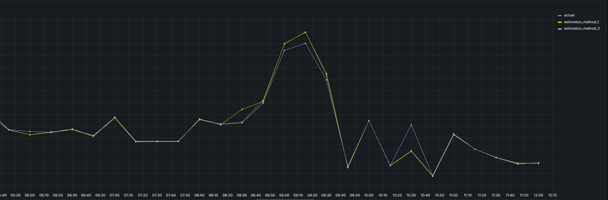

# Imbalance

The electricity grid functions properly only when the production and consumption are balanced at all times, and
there are financial incentives to achieve that.

If our forecasted production is different from the measured production (higher or lower),
we have an imbalance volume. For that we have to pay a penalty.\
The imbalance penalty is calculated in euro per megawatt-hour, we can then compute the imbalance cost for each asset
in our portfolio.\
The dataset contains an estimated imbalance price and a final imbalance price. The imbalance penalty is computed using
the actual price if available, otherwise using the estimate.

For simplification, we provide the actual and estimated data as an end-of-day csv file. Some attributes in the
files are in German, as it is, in both cases, official data from the German regulator.\
Here is an example of real data:

  

