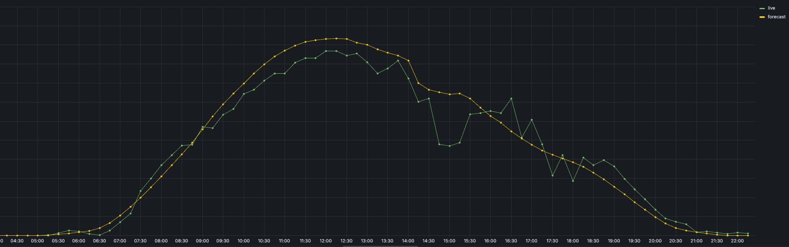

# Virtual Power Plant (VPP)

A Virtual Power Plant (VPP) is a cloud-based system that aggregates the capacities of distributed energy resources 
such as solar panels, wind turbines, battery storage, electric and operates them as a single, flexible power plant.\
In our example it manages technical data of our assets and produces infeed data needed for other functionalities.

## Technical data

Anything that describes the technical aspects of the asset, for example, total capacity, exact location (coordinates)
and some properties that are specific to the asset type, for example, solar or wind. This data is usually used to
compute production forecasts for these assets.
For this challenge, we will restrict ourselves to wind and solar assets, but in general there are more
types (biogas, hydro, batteries...) with their own specific technical data.

The technical data can be downloaded from the vpp (virtual power plant). The file name contains the timestamp
at which the file was created. A new file is produced daily between 12:30 and 13:00.

## Infeeds

### Forecasts:

For each asset, FlexPower forecasts the electricity production for 15-minute delivery intervals,
representing the average power expected to be produced by the asset over a quarter-hour, in kilowatt.
This forecast is updated every 15 minutes and allows FlexPower to know how much electricity will be available to sell
on the markets for a quarter-hour in the future. The latest forecast for each quarter-hour is calculated at the start
of each 15-minute delivery range, but the latest "tradeable" forecast for each asset is produced 15 minutes before
delivery start (due to trading gate closures).
For example, the latest forecast for the delivery start `2025-06-08T12:00:00Z` has the version `2025-06-08T12:00:00Z`
but the latest tradeable forecast has the version `2025-06-08T11:45:00Z`.
To query the forecasts, use the following code snippet:

```python
from src.vpp.client import get_forecast
import pendulum

f = get_forecast(
    asset_id="WND-DE-003",
    version=pendulum.datetime(2025, 6, 8, 8, 15, tz="Europe/Berlin"),
)
```

### Live measured infeed:

In most cases, the vpp provides a live measurement of the energy produced by single assets.
These measurements are available almost instantly, and the production, measured in kilowatt, has an irregular
resolution.\
Here is an example of latest forecast and live measured infeed for an asset:
<div style="display: flex; justify-content: center;">
  
</div>


# To run the script
```

PYTHONPATH=. python src/vpp/forecast_etl.py --asset_forecasts_table asset_forecasts --portfolio_forecast_table portfolio_forecast
```


-- select * from public.dso_final_production order by delivery_start_utc asc ; 384 -> only one day data , missing one assets
-- select * from  asset_forecasts 965 # 3 days data 7 till 9
